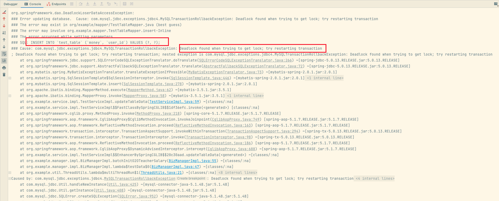

## 说明
项目基于：https://github.com/LiWenGu/transaction_lock

## 复现
新增代码本地复现死锁问题。
1. 准备好数据库
2. 新增代码，模拟多线程下批量删除，循环插入的死锁问题
3. 项目启动后访问：http://localhost:8080/demo/consumer
4. 观察报错



5. 查看数据库死锁：`show engine innodb status \G;`

```shell
------------------------
LATEST DETECTED DEADLOCK
------------------------
2023-04-26 19:18:58 0x308d60000
*** (1) TRANSACTION:
TRANSACTION 56207, ACTIVE 3 sec starting index read
mysql tables in use 1, locked 1
LOCK WAIT 3 lock struct(s), heap size 1136, 2 row lock(s)
MySQL thread id 54, OS thread handle 13033979904, query id 2924 localhost 127.0.0.1 root updating
delete from test_table where user_id = 246
*** (1) WAITING FOR THIS LOCK TO BE GRANTED:
RECORD LOCKS space id 401 page no 3 n bits 96 index PRIMARY of table `test`.`test_table` trx id 56207 lock_mode X locks rec but not gap waiting
Record lock, heap no 29 PHYSICAL RECORD: n_fields 5; compact format; info bits 0
 0: len 8; hex 80000000000000dc; asc         ;;
 1: len 6; hex 00000000db7a; asc      z;;
 2: len 7; hex fa000001750154; asc     u T;;
 3: len 8; hex 800000000000006f; asc        o;;
 4: len 8; hex 80000000000000f6; asc         ;;

*** (2) TRANSACTION:
TRANSACTION 56201, ACTIVE 7 sec inserting
mysql tables in use 1, locked 1
6 lock struct(s), heap size 1136, 24 row lock(s), undo log entries 10
MySQL thread id 55, OS thread handle 13033144320, query id 2932 localhost 127.0.0.1 root update
INSERT INTO `test_table` (`money`, `user_id`) VALUES (111, 135)
*** (2) HOLDS THE LOCK(S):
RECORD LOCKS space id 401 page no 3 n bits 96 index PRIMARY of table `test`.`test_table` trx id 56201 lock_mode X
Record lock, heap no 1 PHYSICAL RECORD: n_fields 1; compact format; info bits 0
 0: len 8; hex 73757072656d756d; asc supremum;;

Record lock, heap no 3 PHYSICAL RECORD: n_fields 5; compact format; info bits 0
 0: len 8; hex 80000000000000e3; asc         ;;
 1: len 6; hex 00000000db8a; asc       ;;
 2: len 7; hex a3000001170154; asc       T;;
 3: len 8; hex 800000000000006f; asc        o;;
 4: len 8; hex 80000000000000f6; asc         ;;

Record lock, heap no 4 PHYSICAL RECORD: n_fields 5; compact format; info bits 32
 0: len 8; hex 80000000000000e0; asc         ;;
 1: len 6; hex 00000000db89; asc       ;;
 2: len 7; hex 22000001342c9d; asc "   4, ;;
 3: len 8; hex 800000000000006f; asc        o;;
 4: len 8; hex 80000000000001c8; asc         ;;

Record lock, heap no 10 PHYSICAL RECORD: n_fields 5; compact format; info bits 0
 0: len 8; hex 80000000000000d0; asc         ;;
 1: len 6; hex 00000000db64; asc      d;;
 2: len 7; hex f00000016c0132; asc     l 2;;
 3: len 8; hex 800000000000006f; asc        o;;
 4: len 8; hex 8000000000000315; asc         ;;

Record lock, heap no 11 PHYSICAL RECORD: n_fields 5; compact format; info bits 32
 0: len 8; hex 80000000000000cf; asc         ;;
 1: len 6; hex 00000000db89; asc       ;;
 2: len 7; hex 22000001342bfe; asc "   4+ ;;
 3: len 8; hex 800000000000006f; asc        o;;
 4: len 8; hex 80000000000001c8; asc         ;;

Record lock, heap no 12 PHYSICAL RECORD: n_fields 5; compact format; info bits 0
 0: len 8; hex 80000000000000d5; asc         ;;
 1: len 6; hex 00000000db65; asc      e;;
 2: len 7; hex f10000016d0132; asc     m 2;;
 3: len 8; hex 800000000000006f; asc        o;;
 4: len 8; hex 8000000000000315; asc         ;;

Record lock, heap no 13 PHYSICAL RECORD: n_fields 5; compact format; info bits 0
 0: len 8; hex 80000000000000da; asc         ;;
 1: len 6; hex 00000000db7a; asc      z;;
 2: len 7; hex fa000001750132; asc     u 2;;
 3: len 8; hex 800000000000006f; asc        o;;
 4: len 8; hex 8000000000000315; asc         ;;

Record lock, heap no 17 PHYSICAL RECORD: n_fields 5; compact format; info bits 0
 0: len 8; hex 80000000000000e2; asc         ;;
 1: len 6; hex 00000000db8a; asc       ;;
 2: len 7; hex a3000001170143; asc       C;;
 3: len 8; hex 800000000000006f; asc        o;;
 4: len 8; hex 8000000000000087; asc         ;;

Record lock, heap no 19 PHYSICAL RECORD: n_fields 5; compact format; info bits 32
 0: len 8; hex 80000000000000c5; asc         ;;
 1: len 6; hex 00000000db89; asc       ;;
 2: len 7; hex 22000001342b94; asc "   4+ ;;
 3: len 8; hex 800000000000006f; asc        o;;
 4: len 8; hex 80000000000001c8; asc         ;;

Record lock, heap no 20 PHYSICAL RECORD: n_fields 5; compact format; info bits 0
 0: len 8; hex 80000000000000db; asc         ;;
 1: len 6; hex 00000000db7a; asc      z;;
 2: len 7; hex fa000001750143; asc     u C;;
 3: len 8; hex 800000000000006f; asc        o;;
 4: len 8; hex 8000000000000087; asc         ;;

Record lock, heap no 22 PHYSICAL RECORD: n_fields 5; compact format; info bits 32
 0: len 8; hex 80000000000000d9; asc         ;;
 1: len 6; hex 00000000db89; asc       ;;
 2: len 7; hex 22000001342c68; asc "   4,h;;
 3: len 8; hex 800000000000006f; asc        o;;
 4: len 8; hex 80000000000001c8; asc         ;;

Record lock, heap no 23 PHYSICAL RECORD: n_fields 5; compact format; info bits 0
 0: len 8; hex 80000000000000de; asc         ;;
 1: len 6; hex 00000000db8a; asc       ;;
 2: len 7; hex a3000001170110; asc        ;;
 3: len 8; hex 800000000000006f; asc        o;;
 4: len 8; hex 800000000000007b; asc        {;;

Record lock, heap no 24 PHYSICAL RECORD: n_fields 5; compact format; info bits 0
 0: len 8; hex 80000000000000e1; asc         ;;
 1: len 6; hex 00000000db8a; asc       ;;
 2: len 7; hex a3000001170132; asc       2;;
 3: len 8; hex 800000000000006f; asc        o;;
 4: len 8; hex 8000000000000315; asc         ;;

Record lock, heap no 25 PHYSICAL RECORD: n_fields 5; compact format; info bits 32
 0: len 8; hex 80000000000000ca; asc         ;;
 1: len 6; hex 00000000db89; asc       ;;
 2: len 7; hex 22000001342bc9; asc "   4+ ;;
 3: len 8; hex 800000000000006f; asc        o;;
 4: len 8; hex 80000000000001c8; asc         ;;

Record lock, heap no 28 PHYSICAL RECORD: n_fields 5; compact format; info bits 32
 0: len 8; hex 80000000000000d4; asc         ;;
 1: len 6; hex 00000000db89; asc       ;;
 2: len 7; hex 22000001342c33; asc "   4,3;;
 3: len 8; hex 800000000000006f; asc        o;;
 4: len 8; hex 80000000000001c8; asc         ;;

Record lock, heap no 29 PHYSICAL RECORD: n_fields 5; compact format; info bits 0
 0: len 8; hex 80000000000000dc; asc         ;;
 1: len 6; hex 00000000db7a; asc      z;;
 2: len 7; hex fa000001750154; asc     u T;;
 3: len 8; hex 800000000000006f; asc        o;;
 4: len 8; hex 80000000000000f6; asc         ;;

Record lock, heap no 30 PHYSICAL RECORD: n_fields 5; compact format; info bits 0
 0: len 8; hex 80000000000000d6; asc         ;;
 1: len 6; hex 00000000db65; asc      e;;
 2: len 7; hex f10000016d0143; asc     m C;;
 3: len 8; hex 800000000000006f; asc        o;;
 4: len 8; hex 8000000000000087; asc         ;;

*** (2) WAITING FOR THIS LOCK TO BE GRANTED:
RECORD LOCKS space id 401 page no 4 n bits 96 index idx_user_id of table `test`.`test_table` trx id 56201 lock_mode X locks gap before rec insert intention waiting
Record lock, heap no 29 PHYSICAL RECORD: n_fields 2; compact format; info bits 0
 0: len 8; hex 80000000000000f6; asc         ;;
 1: len 8; hex 80000000000000dc; asc         ;;

*** WE ROLL BACK TRANSACTION (1)
------------
TRANSACTIONS
------------
Trx id counter 56213
Purge done for trx's n:o < 56213 undo n:o < 0 state: running but idle
History list length 27
LIST OF TRANSACTIONS FOR EACH SESSION:
---TRANSACTION 421699239421688, not started
0 lock struct(s), heap size 1136, 0 row lock(s)
---TRANSACTION 421699239420784, not started
0 lock struct(s), heap size 1136, 0 row lock(s)
---TRANSACTION 421699239419880, not started
0 lock struct(s), heap size 1136, 0 row lock(s)
---TRANSACTION 421699239418072, not started
0 lock struct(s), heap size 1136, 0 row lock(s)
---TRANSACTION 421699239418976, not started
0 lock struct(s), heap size 1136, 0 row lock(s)
---TRANSACTION 421699239417168, not started
0 lock struct(s), heap size 1136, 0 row lock(s)
---TRANSACTION 421699239416264, not started
0 lock struct(s), heap size 1136, 0 row lock(s)
---TRANSACTION 421699239414456, not started
0 lock struct(s), heap size 1136, 0 row lock(s)
---TRANSACTION 421699239413552, not started
0 lock struct(s), heap size 1136, 0 row lock(s)
---TRANSACTION 421699239415360, not started
0 lock struct(s), heap size 1136, 0 row lock(s)
--------
FILE I/O
--------
I/O thread 0 state: waiting for i/o request (insert buffer thread)
I/O thread 1 state: waiting for i/o request (log thread)
I/O thread 2 state: waiting for i/o request (read thread)
I/O thread 3 state: waiting for i/o request (read thread)
I/O thread 4 state: waiting for i/o request (read thread)
I/O thread 5 state: waiting for i/o request (read thread)
I/O thread 6 state: waiting for i/o request (write thread)
I/O thread 7 state: waiting for i/o request (write thread)
I/O thread 8 state: waiting for i/o request (write thread)
I/O thread 9 state: waiting for i/o request (write thread)
Pending normal aio reads: [0, 0, 0, 0] , aio writes: [0, 0, 0, 0] ,
 ibuf aio reads:, log i/o's:, sync i/o's:
Pending flushes (fsync) log: 0; buffer pool: 0
474 OS file reads, 1776 OS file writes, 835 OS fsyncs
0.00 reads/s, 0 avg bytes/read, 0.00 writes/s, 0.00 fsyncs/s
-------------------------------------
INSERT BUFFER AND ADAPTIVE HASH INDEX
-------------------------------------
Ibuf: size 1, free list len 0, seg size 2, 0 merges
merged operations:
 insert 0, delete mark 0, delete 0
discarded operations:
 insert 0, delete mark 0, delete 0
Hash table size 34673, node heap has 2 buffer(s)
Hash table size 34673, node heap has 0 buffer(s)
Hash table size 34673, node heap has 0 buffer(s)
Hash table size 34673, node heap has 0 buffer(s)
Hash table size 34673, node heap has 1 buffer(s)
Hash table size 34673, node heap has 0 buffer(s)
Hash table size 34673, node heap has 0 buffer(s)
Hash table size 34673, node heap has 2 buffer(s)
0.00 hash searches/s, 0.00 non-hash searches/s
---
LOG
---
Log sequence number 9984533
Log flushed up to   9984533
Pages flushed up to 9984533
Last checkpoint at  9984524
0 pending log flushes, 0 pending chkp writes
554 log i/o's done, 0.00 log i/o's/second
----------------------
BUFFER POOL AND MEMORY
----------------------
Total large memory allocated 137428992
Dictionary memory allocated 170536
Buffer pool size   8191
Free buffers       7679
Database pages     507
Old database pages 0
Modified db pages  0
Pending reads      0
Pending writes: LRU 0, flush list 0, single page 0
Pages made young 0, not young 0
0.00 youngs/s, 0.00 non-youngs/s
Pages read 432, created 75, written 1133
0.00 reads/s, 0.00 creates/s, 0.00 writes/s
No buffer pool page gets since the last printout
Pages read ahead 0.00/s, evicted without access 0.00/s, Random read ahead 0.00/s
LRU len: 507, unzip_LRU len: 0
I/O sum[0]:cur[0], unzip sum[0]:cur[0]
--------------
ROW OPERATIONS
--------------
0 queries inside InnoDB, 0 queries in queue
0 read views open inside InnoDB
Process ID=28062, Main thread ID=13026086912, state: sleeping
Number of rows inserted 1754, updated 5, deleted 220, read 3451
0.00 inserts/s, 0.00 updates/s, 0.00 deletes/s, 0.00 reads/s
----------------------------
END OF INNODB MONITOR OUTPUT
============================

1 row in set (0.01 sec)

ERROR:
No query specified
```

